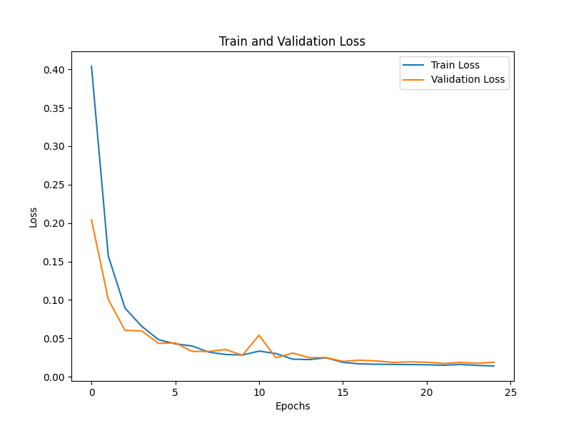
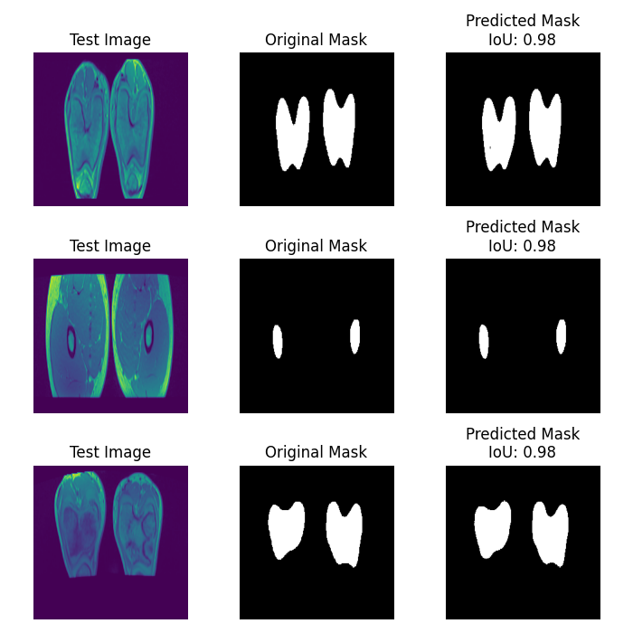
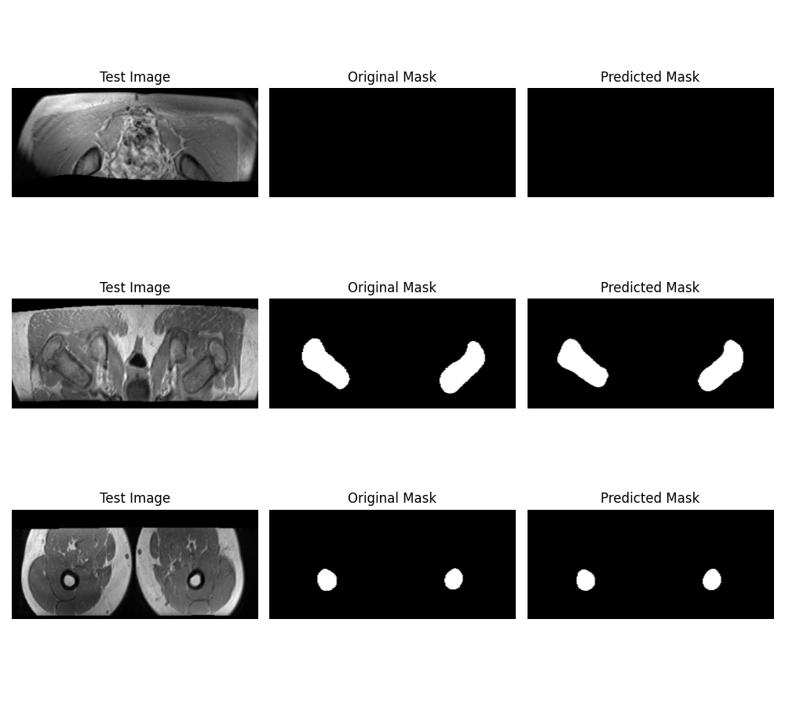

# README

## Project Overview
This project focuses on medical image segmentation using a U-Net model enhanced with an attention mechanism. The pipeline includes data preprocessing, model training, and evaluation, with custom loss functions and visualization utilities.

## File Structure

### Configuration Files
- **config.py**: Defines the paths for the image and mask datasets.

### Data Preparation
- **data_utils.py**:
  - `preview_image_and_mask`: Displays a preview of images and masks.
  - `load_and_prepare_data`: Loads and preprocesses images and masks for training and validation.

### Model Definition
- **model_utils.py**:
  - Implements the U-Net architecture with attention blocks for enhanced feature extraction.

### Training and Evaluation
- **train.py**:
  - Loads the dataset, splits it into training and validation sets, and trains the model.
  - Visualizes training and validation loss.
  - Displays predictions for qualitative evaluation.

- **main.py**:
  - Contains the `train_model` function with callbacks for saving the best model, reducing learning rate, and early stopping.

- **losses.py**:
  - Implements custom loss functions, including Dice loss and boundary loss, and combines them for validation.

- **visualization.py**:
  - `plot_loss`: Plots training and validation loss.
  - `display_predictions`: Visualizes model predictions alongside ground truth.

### Testing
- **test.py**:
  - Loads the test dataset.
  - Evaluates the model using metrics like Dice coefficient and Intersection over Union (IoU).
  - Displays predictions for random test samples.

### Utilities
- **merge_folder.py**:
  - Merges image files from multiple subfolders into a single directory, renaming them appropriately.

## Installation
1. Clone the repository:
   ```bash
   git clone <[repository-url](https://github.com/AnningTian/orith_unet_for_MRI_bone_segmentation.git)>
   ```
2. Install the required Python packages:
   ```bash
   pip install -r requirements.txt
   ```
3. Ensure TensorFlow is configured for GPU if available.

## Usage

### Training
1. Set the image and mask paths in `config.py`.
2. Run `train.py` to train the model:
   ```bash
   python train.py
   ```

### Testing
1. Specify the test dataset directories and trained model path in `test.py`.
2. Run `test.py` to evaluate the model:
   ```bash
   python test.py
   ```

### Data Preparation
To merge images into a single directory, use `merge_folder.py`:
```bash
python merge_folder.py
```

### Visualization
- Training and validation loss: Automatically generated during training.
- Predictions:
  - Validation set predictions: Displayed after training in `train.py`.
  - Test set predictions: Displayed during testing in `test.py`.

## Customization
- Modify the U-Net architecture in `model_utils.py` to adjust layers or add features.
- Update `losses.py` to experiment with new loss functions.
- Change training parameters (e.g., batch size, epochs) in `train.py` or `main.py`.

## Models
- After run the `train.py`, the model will saved in `models` file folder.
- User can mannuly save the result images to `results` folder to replace the original results image.

## Results
1. **Training and Validation Loss**: 
2. **Validation Results**: 
3. **Test Results**: 


